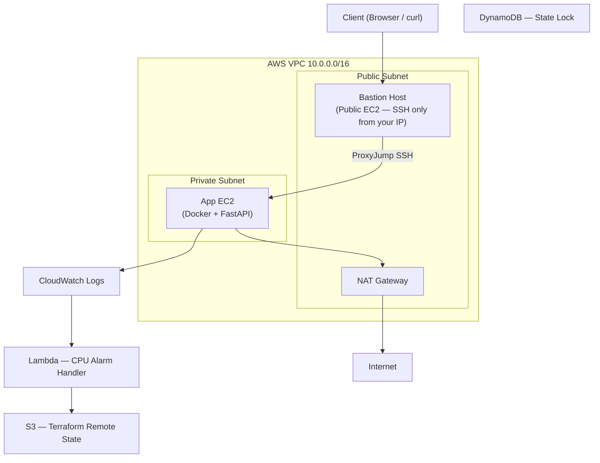

# AWS Production Infrastructure Blueprint

> End-to-end cloud infrastructure provisioned with Terraform, configured with Ansible, and deployed with Docker — using secure private networking, IAM least privilege, and centralized observability.


---

## What This Project Demonstrates

This project simulates what a cloud/DevOps engineer does on the job — not just provisioning infrastructure, but **operating it**: catching drift, recovering from state corruption, enforcing idempotency, and debugging real failures with written incident reports.

**Core competencies demonstrated:**
- Infrastructure as Code (Terraform) with remote state and environment isolation
- Configuration Management (Ansible) with idempotency validation
- Secure AWS networking with bastion + private subnet architecture
- IAM least privilege design
- Observability via CloudWatch
- Operational debugging across 5 failure scenarios

---

## Architecture



**Security model:** The application EC2 has no public IP and accepts SSH only from the bastion's security group. The bastion accepts port 22 only from a single authorized CIDR. Outbound internet for the private EC2 routes through NAT Gateway — no inbound exposure.

---

## Tech Stack

| Layer | Tool |
|---|---|
| Infrastructure as Code | Terraform |
| Configuration Management | Ansible (role-based) |
| Cloud Provider | AWS (EC2, VPC, IAM, S3, CloudWatch, Lambda) |
| Application Runtime | Docker |
| Application | FastAPI (from [Project 2](../bug-tracker-containerized-stack)) |
| State Backend | S3 + DynamoDB (locking) |

---

## Engineering Highlights

**Secure Networking**
VPC designed with strict subnet isolation: application EC2 lives in a private subnet with no public IP. Internet access for outbound traffic (Docker pulls, package installs) routes through NAT Gateway. SSH access follows a jump-host pattern — bastion → private EC2 via ProxyJump — so the app server is never directly reachable.

**IAM Least Privilege**
EC2 instance role scoped to exactly two permissions: `s3:GetObject` on the specific artifact bucket and `logs:PutLogEvents` + `logs:CreateLogStream` on the CloudWatch log group. No wildcard actions, no wildcard resources. Spent time debugging a real permission error when CloudWatch agent failed silently — traced it to a missing `logs:DescribeLogGroups` permission.

**Terraform Remote State with Locking**
S3 backend configured for state persistence; DynamoDB table provides state locking to prevent concurrent apply collisions. Separate state keys per environment (`dev/terraform.tfstate`, `stage/terraform.tfstate`) enforced via `-backend-config` at init time rather than hardcoded in config — keeps environments properly isolated.

**Idempotent Ansible Roles**
Playbook structured into four roles: `docker`, `firewall`, `app`, `cloudwatch`. Validated idempotency by running the playbook twice and confirming zero changed tasks on the second run. Where tasks initially failed idempotency (package installs triggering changes), fixed them with proper `state: present` declarations and conditional guards.

**CloudWatch + Lambda Integration**
CloudWatch agent installed and configured via Ansible to ship system logs from the private EC2 to a log group. A Lambda function subscribed to a CPU utilization alarm — when the alarm fires, Lambda logs the event payload to S3. Deployed via AWS console to understand the wiring; not production-grade, but validates the alerting pipeline end-to-end.

---

## Incident Reports

Five real failure scenarios were reproduced and documented. This section exists because debugging is what production engineering actually looks like.

| Incident | What Happened | How It Was Resolved |
|---|---|---|
| [Terraform Drift Detection](./incident_reports/terraform-drift.md) | Manually deleted a security group rule in the console, then ran `terraform plan` | Plan showed the drift as a resource to re-add. Documented detection method and why state-driven infra catches this automatically |
| [State File Corruption](./incident_reports/terraform-state-corruption.md) | Renamed the remote state file to simulate corruption, then attempted `terraform apply` | Terraform threw a backend initialization error. Recovery: restored the backup state key, re-ran `terraform init`, validated with `terraform plan` |
| [Ansible Idempotency Failure](./incident_reports/ansible-idempotency-failure.md) | Second playbook run showed changed tasks in the `docker` role | Root cause: `apt install` without `state: present`. Fixed with idempotent task declarations; second run confirmed 0 changes |
| [Terraform State Locking](./incident_reports/terraform-locking.md) | Simulated concurrent `terraform apply` by interrupting a run mid-execution | Without DynamoDB, state file can be overwritten. With locking, second apply is blocked until the lock is released or force-unlocked |
| [NAT Connectivity Failure](./incident_reports/nat-connectivity-incident.md) | Private EC2 had no outbound internet access after initial provisioning | NAT Gateway was in the wrong subnet. Fixed subnet association, verified with `curl` from private EC2 |

---

## ECS vs Kubernetes — When to Use Each

This project deploys containers directly on EC2 via Docker. In a production system, you'd likely use an orchestrator. Here's the decision framework:

**Choose ECS (especially with Fargate) when:**
- Your team is AWS-native and wants minimal operational overhead
- You don't need multi-cloud portability
- The workload is straightforward: run containers, scale them, done
- You want to avoid managing control planes entirely (Fargate handles this)
- Cost predictability matters more than scheduling flexibility

**Choose Kubernetes (EKS or self-managed) when:**
- You need fine-grained scheduling, affinity rules, or custom controllers
- The system has multiple teams deploying independently (namespace isolation)
- Multi-cloud or on-prem portability is a requirement
- Your team already has Kubernetes expertise and the complexity is justified
- You need ecosystem tools: Argo CD, Keda, Istio, Prometheus Operator

**What Fargate is:** AWS Fargate is a serverless compute engine for containers — you define the task (CPU, memory, image), and AWS handles the underlying EC2 provisioning. No nodes to patch, no cluster capacity to manage. Works with both ECS and EKS. The tradeoff is less control over the host and slightly higher per-unit cost vs. reserved EC2.

**This project used raw Docker on EC2** to understand what orchestrators abstract away — container lifecycle, networking, restarts — before relying on tools that hide it.

---

## Project Structure

```
aws-production-infra-blueprint/
│
├── terraform/
│   ├── main.tf             # VPC, subnets, EC2, NAT Gateway, SGs
│   ├── variables.tf
│   ├── iam.tf              # Least-privilege EC2 role
│   ├── backend.tf          # S3 + DynamoDB remote state
│   ├── dev.tfvars
│   └── stage.tfvars
│
├── ansible/
│   ├── inventory.ini       # ProxyJump via bastion
│   ├── playbook.yml
│   └── roles/
│       ├── docker/         # Install + configure Docker
│       ├── firewall/       # UFW rules
│       ├── app/            # Pull and run containerized FastAPI
│       └── cloudwatch/     # Agent install + log shipping config
│
├── lambda/
│   └── cpu_alarm_handler.py   # Logs alarm event to S3
│
├── incident_reports/
│   ├── terraform-drift.md
│   ├── terraform-state-corruption.md
│   ├── terraform-locking.md
│   ├── ansible-idempotency-failure.md
│   └── nat-connectivity-incident.md
│
├── docs/
│   └── architecture.md
│
├── demo/
│   └── demo.gif
│
└── README.md
```

---

## How to Run

### Prerequisites
- AWS CLI configured (`aws configure`)
- Terraform ≥ 1.5
- Ansible ≥ 2.14
- SSH key pair added to AWS and available locally

### 1. Provision Infrastructure

```bash
cd terraform
terraform init \
  -backend-config="bucket=<your-state-bucket>" \
  -backend-config="key=dev/terraform.tfstate" \
  -backend-config="region=ap-south-1"

terraform apply -var-file="dev.tfvars"
```

### 2. Configure and Deploy Application

```bash
cd ../ansible
# Update inventory.ini with bastion and private EC2 IPs from Terraform output
ansible-playbook -i inventory.ini playbook.yml
```

### 3. Validate Idempotency

```bash
ansible-playbook -i inventory.ini playbook.yml
# Expected: 0 changed tasks
```

### 4. Access Application

```bash
ssh -J ubuntu@<bastion-ip> ubuntu@<private-ec2-ip>
curl localhost:8080
```

### 5. Verify CloudWatch Logs

```
AWS Console → CloudWatch → Log Groups → /dev/ec2/syslog
```

---

## Demo


Walkthrough covers: Terraform provisioning → Ansible configuration → SSH via bastion → app responding → CloudWatch log delivery

---

## Known Limitations

- No HTTPS / TLS termination
- No Application Load Balancer
- No autoscaling
- No secrets management (SSM Parameter Store or Secrets Manager)
- Lambda deployment is manual (no IaC for Lambda yet)
- No CI/CD pipeline

## Planned Improvements

- [ ] Replace NAT instance with NAT Gateway (already partially done — verify this)
- [ ] Add ALB with HTTPS via ACM
- [ ] Terraform module for reusable VPC pattern
- [ ] GitHub Actions pipeline for plan + apply
- [ ] Secrets via AWS Secrets Manager
- [ ] Prometheus + Grafana for metrics beyond CloudWatch

---

## Related Projects

- [P1 — Linux Reliability Toolkit](../linux-reliability-toolkit) — System monitoring and failure simulation
- [P2 — Bug Tracker Containerized Stack](../bug-tracker-containerized-stack) — FastAPI + PostgreSQL + Nginx in Docker
