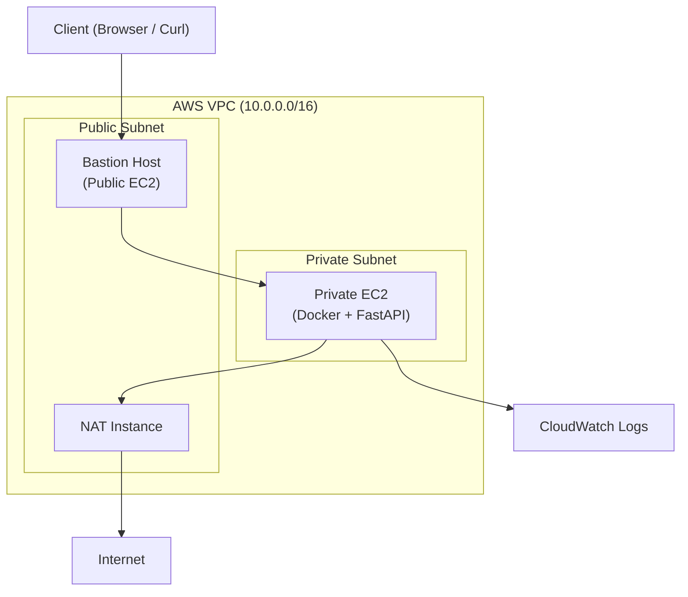

# Architecture Overview

## System Components

### Client

Represents the end user accessing the application.

* Uses browser or curl
* Sends HTTP requests to the infrastructure

### Bastion Host (Public EC2)

Acts as a secure entry point to the private network.

* Deployed in public subnet
* Allows SSH access from user's IP only
* Used as a jump host to access private EC2

### Private EC2 (Application Server)

Runs the application in a secure environment.

* Deployed in private subnet
* No direct internet access
* Hosts Docker container running FastAPI app

### NAT Instance

Enables outbound internet access for private EC2.

* Located in public subnet
* Performs source NAT using iptables
* Allows private EC2 to:
  * Pull Docker images
  * Install packages

### Docker (Application Layer)

Runs the containerized application.

* Pulls image from Docker Hub
* Runs FastAPI service
* Exposes port `8000` inside container

### CloudWatch (Logging)

Centralized logging system.

* Collects logs from EC2 instances
* Stores logs in log groups
* Used for monitoring and debugging

### IAM Role

Provides permissions to EC2 instances.

* Allows:
  * S3 access (optional)
  * CloudWatch log publishing
* Attached to EC2 via instance profile

### Terraform

Handles infrastructure provisioning.

* Creates:
  * VPC
  * Subnets
  * EC2 instances
  * Security groups
  * IAM roles
* Uses S3 backend + DynamoDB for state management

### Ansible

Handles configuration management.

* Configures:
  * NAT iptables rules
  * Docker installation
  * Application deployment
  * CloudWatch agent setup
* Uses role-based structure

## Architecture Diagram

## Request Flow

1. User connects via SSH:

2. Inside private EC2:

3. Request flow:

`Client → Bastion → Private EC2 → Docker Container`

4. Response returns:

`Container → EC2 → Bastion → Client`

## Network Flow (Outbound)

- Private EC2 needs internet for:

    - Docker image pull
    - Package installation

Flow:

`Private EC2 → NAT Instance → Internet`

## Deployment Flow

1. Terraform provisions infrastructure
2. Ansible configures systems
3. Docker container is deployed
4. CloudWatch agent starts logging

## Key Design Decisions

1. Private Subnet Isolation
    - Application is not exposed directly to internet.
2. Bastion-Based Access
    - All access controlled through a single secure entry point.
3. Infrastructure as Code
    - Terraform ensures reproducibility and consistency.
4. Idempotent Configuration
    - Ansible ensures safe repeated execution.
5. Centralized Logging
    - CloudWatch provides visibility into system behavior.

## Summary

This architecture demonstrates:

- Secure cloud networking
- Infrastructure automation
- Configuration management
- Containerized application deployment
- Observability and debugging in production-like environments